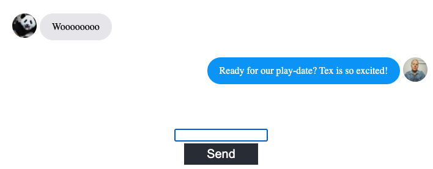

# [Fetch Mate](https://test1-57cd1.web.app)


## A Community inspired web-app designed to help users find play-dates for their pets!

---

### A General Assembly team project created by [Stacey Brosnan](https://github.com/StaceyBros), [Sarah Hong](https://github.com/sarahhae), [Bastien Durand](https://github.com/BasilExpeditions) and [Ryan Bullough](https://github.com/rjbullough)

<!-- image here showing the home page? -->

Fetch Mate was built using **React** and **Firebase.**

It features -

1. User authentication and federation through both email and Google 
2. A messaging component 
3. A Tinder-like 'swipe card' element allowing users to browse other pets near them 

---

### Challenges faced

This was our first project using both React and Firebase. We found it very challenging to keep track of our users' authentication status whilst navigating throughout the app. This was solved using React's `useContext` hook -

```
class UserProvider extends Component {
  state = {
    user: null,
  };
  componentDidMount = () => {
    auth.onAuthStateChanged(async (userAuth) => {
      const user = await generateUserDocument(userAuth);
      this.setState({ user });
    });
  };
  render() {
    return (
      <UserContext.Provider value={this.state.user}>
        {this.props.children}
      </UserContext.Provider>
    );
  }
}
```

---

**Stacey** championed the ability to search for other profiles based on the users current position. This was done using the [Geofirestore library](https://geofirestore.com/).

```
import firebase from "firebase/app";
import * as geofirestore from "geofirestore";
import { useContext } from "react";
import { UserContext } from "../../providers/UserProvider";


const GetNearbyUsers = (event) => {
  const user = useContext(UserContext).uid;
  const userRef = firestore.collection("users").doc(user);

  const firestore = firebase.firestore();
  const GeoFirestore = geofirestore.initializeApp(firestore);
  const geoCollection = GeoFirestore.collection("users");

  userRef.get().then(function (doc) {
    const query = geoCollection.near({
      center: new firebase.firestore.GeoPoint(
        doc.data().coordinates["r_"],
        doc.data().coordinates["o_"]
      ),
      radius: 10000,
    });
```

---

**Bastien** handled the swipe card functionality using [React-Tinder-Card](https://www.npmjs.com/package/react-tinder-card)

```

  const swipe = (dir) => {
    const cardsLeft = characters.filter(person => !alredyRemoved.includes(person.name))
    if (cardsLeft.length) {
      const toBeRemoved = cardsLeft[cardsLeft.length - 1].name // Find the card object to be removed
      const index = db.map(person => person.name).indexOf(toBeRemoved) // Find the index of which to make the reference to
      alredyRemoved.push(toBeRemoved) // Make sure the next card gets removed next time if this card do not have time to exit the screen
      childRefs[index].current.swipe(dir) // Swipe the card!
    }
  }
```

---

**Sarah** implemented our chat component! This was done by adding documents to a firestore collection and listening to changes

```
const ChatRoom = () => {
  const dummy = useRef();
  // Reference a firestore collection - display on firestore everytime someone messages
  const messagesRef = firestore.collection("messages");
  // Make query documents in a collection
  const query = messagesRef.orderBy("createdAt").limit(1000);
  const [messages] = useCollectionData(query, { idField: "id" }); // Used collection data hook
  const [formValue, setFormValue] = useState(""); // stateful value to the formValue component, store as an empty string

  // write value to firestore
  const sendMessage = async (e) => {
    e.preventDefault(); // when form is submitted, stop from refreshing
    const { uid, photoURL } = auth.currentUser;

    // Create new document in firestore
    await messagesRef.add({
      text: formValue,
      createdAt: firebase.firestore.FieldValue.serverTimestamp(),
      uid,

      photoURL,
    });
    setFormValue("");
    dummy.current.scrollIntoView({ behavior: "smooth" });
  };
```

---

### To Do / Future features

1. We'd like to further enhance our profile locating functionality and give the user the ability to search in locations other than where they are
2. We'd like to improve our mobile experience
3. We'd like to enhance our profile creation experience
